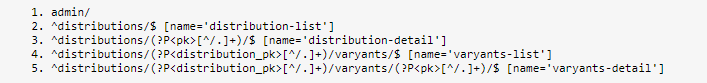
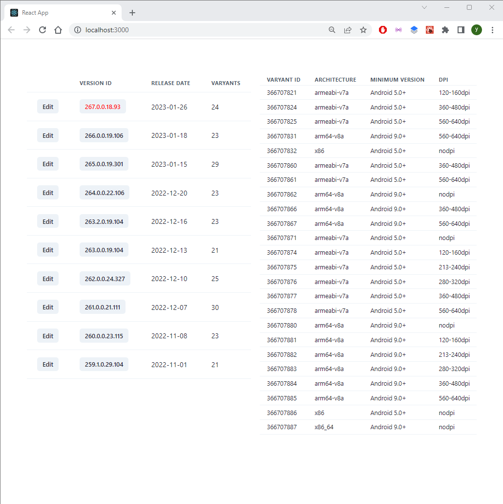
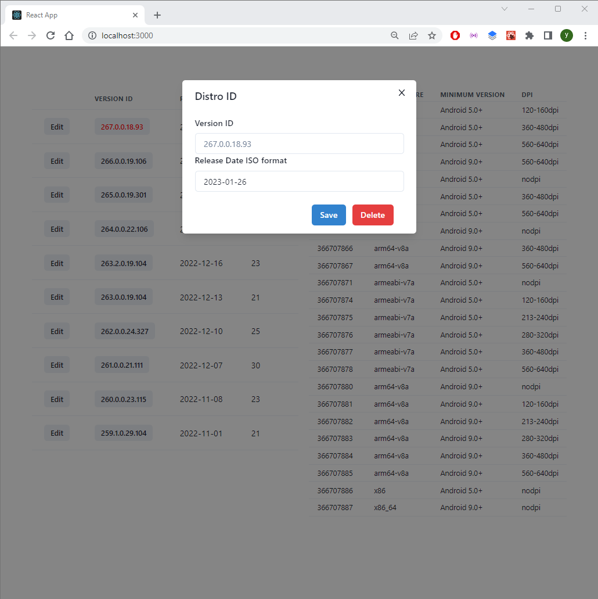

# OXO TASK

This project has last 10 APK distribution of Instagram without beta and alpha versions includes release date, varyant informations which are varyant id, architecture, minimum android version and DPI. The s

These information gained from: https://www.apkmirror.com/apk/instagram/instagram-instagram/

- Mongodb
- Docker
- Django (Rest)
- React

## Instalation

```git
mkdir OxoTask
cd OxoTask
git clone https://...
```

### Docker

```docker
docker-compose up -d --build
docker-compose exec backend python manage.py migrate
docker-compose exec backend python manage.py makemigrations
docker-compose exec backend python manage.py runserver
```

### Regular

```
cd backend
python -m venv venv
venv/Script/activate
pip install -r requiremnts.txt
python manage.py migrate
python manage.py makemigrations
python manage.py runserver

cd ../frontend
npm install
npm start
```

---

## Usage

### URLs
- admin/ : admin panel
- distributions/***pk***/
- distributions/***pk***/varyants/
- distributions/***pk***/varyants/***pk***/

APIs support CRUD operations.



---

You can see the distributions list at the left side of the page and
if you click the one of distribution, varyants will be apear at the right 
side of the page.



---

For UPDATE and DELETE functionality click edit button then modal
will pop up so you can make changes.



## **Refferance Book**


